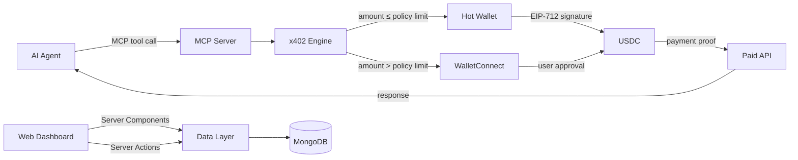

# Brevet


Brevet gives AI agents spending authority, backed by your wallet.

When an agent needs to access a paid service, Brevet handles the
entire flow: detecting payment requests, signing transactions, and
retrying with cryptographic proof. All within a single tool call.

Connect your wallet to approve payments directly. Or configure
auto-signing for small amounts. Spending policies enforce per-request,
hourly, and daily limits. You define the boundaries. Your agent
operates within them.

## What is this?

When an AI agent hits a paid service, Brevet handles the entire payment flow: detecting the [x402](https://www.x402.org/) payment request, signing the transaction with EIP-712 (EIP-3009 `TransferWithAuthorization`), and completing the payment with cryptographic proof. The payment comes from your connected wallet. Small amounts can be auto-signed for speed; larger amounts route to your wallet for explicit approval. You set per-request, hourly, and daily spending limits. Supports Ethereum L1 and multiple L2 chains: Base, Arbitrum, Optimism, and Polygon (mainnets + testnets).

## Features

- **x402 Payment Engine** -- Automatic HTTP 402 payment negotiation with EIP-712 signed USDC transfers across Ethereum L1 and multiple L2 chains
- **Multi-Chain Support** -- Ethereum L1, Base, Arbitrum, Optimism, Polygon (mainnets + testnets) with automatic chain selection based on endpoint requirements and wallet balances
- **Tiered Signing** -- Small payments auto-signed by hot wallet; larger payments require WalletConnect approval
- **MCP Server** -- 6 tools for AI agents: `x402_pay`, `x402_check_balance`, `x402_spending_history`, `x402_check_pending`, `x402_get_result`, `x402_discover`
- **Endpoint Discovery** -- Search for x402-protected APIs via CDP Bazaar integration
- **Hot Wallet Management** -- Create, fund, and withdraw USDC with AES-256-GCM encrypted key storage
- **Spending Policies** -- Configurable per-request, per-hour, and per-day limits with endpoint whitelist/blacklist
- **Pending Payment Approval** -- Dashboard UI for reviewing and approving WalletConnect-tier payments
- **Session Health Monitoring** -- Real-time WalletConnect connection status
- **Spending Analytics** -- Daily spending chart with summary cards
- **Transaction History** -- Filterable list with on-chain verification via block explorers
- **Docker Compose** -- One-command local development with MongoDB and Next.js dev server
- **Environment-Driven Chain Config** -- Switch default chain via a single env var

## Architecture



## Quick Start

### Prerequisites

- Node.js 18+
- npm
- MongoDB (via Docker or external)

### Setup

```bash
# Clone the repository
git clone https://github.com/marcopesani/brevet.git
cd brevet

# Install dependencies
npm install

# Copy environment file and configure
cp .env.example .env.local

# Generate a hot wallet encryption key
node -e "console.log(require('crypto').randomBytes(32).toString('hex'))"
# Add the output to HOT_WALLET_ENCRYPTION_KEY in .env.local

# Start MongoDB and the dev server with Docker
docker compose up -d
```

Or, if you have MongoDB running separately:

```bash
# Set MONGODB_URI in .env.local, then:
npm run dev
```

Open [http://localhost:3000](http://localhost:3000) to access the dashboard.

## MCP Integration

Brevet exposes an MCP endpoint at `/api/mcp/{userId}` using [Streamable HTTP transport](https://modelcontextprotocol.io/specification/2025-03-26/basic/transports#streamable-http). Connect any MCP-compatible AI agent by pointing it to this URL.

### Tools

#### `x402_pay`

Make an HTTP request to an x402-protected URL. Automatically handles 402 payment negotiation. Supports multiple chains (Ethereum, Base, Arbitrum, Optimism, Polygon + testnets). If no chain is specified, the gateway auto-selects the best chain based on the endpoint's accepted networks and the user's balances.

```json
{
  "url": "https://api.example.com/premium-data",
  "method": "GET",
  "chain": "base"
}
```

#### `x402_check_balance`

Check the hot wallet USDC balance. If no chain is specified, returns balances across all chains where the user has a wallet. Also lists per-endpoint policies.

```json
{
  "chain": "arbitrum"
}
```

#### `x402_spending_history`

Query transaction history with optional date and chain filters.

```json
{
  "since": "2025-01-01T00:00:00Z",
  "chain": "base"
}
```

#### `x402_check_pending`

Poll the status of a pending payment awaiting WalletConnect approval. Returns chain information for each payment.

```json
{
  "paymentId": "clx..."
}
```

#### `x402_get_result`

Retrieve the result of a previously initiated x402 payment. Call this after the user confirms they have signed the payment in the dashboard. Returns the protected resource data if payment is complete, or the current status if still pending.

```json
{
  "paymentId": "clx..."
}
```

#### `x402_discover`

Search the CDP Bazaar discovery API for available x402-protected endpoints. Returns a list of endpoints with their URL, description, price, network, and payment scheme.

```json
{
  "query": "weather",
  "network": "base-sepolia",
  "limit": 10
}
```

### Example: Claude Desktop Configuration

```json
{
  "mcpServers": {
    "brevet": {
      "url": "http://localhost:3000/api/mcp/your-user-id"
    }
  }
}
```

## API Reference

Dashboard data flows through Server Components and Server Actions (not REST APIs). Only these API routes exist:

| Method | Path | Description |
|--------|------|-------------|
| `POST` | `/api/auth/[...nextauth]` | NextAuth authentication (SIWE) |
| `POST` | `/api/auth/dev-login` | Development login (dev only) |
| `POST` | `/api/mcp/[userId]` | MCP server endpoint (Streamable HTTP) |
| `GET` | `/api/payments/pending` | Pending payments polling (React Query) |

## Testing

The project includes ~434 tests across two Vitest projects (`unit` and `e2e`).

```bash
# Run all unit and integration tests (watch mode)
npm test

# Run all tests once (CI mode)
npm run test:run

# Run only E2E tests (requires Base Sepolia RPC access)
npm run test:e2e

# Run a single test file
npx vitest run src/lib/__tests__/policy.test.ts

# Run a single test by name
npx vitest run -t "test name pattern"
```

Tests require MongoDB — start it with `docker compose up -d mongodb` or point `MONGODB_URI` to an existing instance. The test setup uses `mongodb-memory-server` for in-memory MongoDB.

### Browser E2E (Synpress + Playwright + MetaMask)

The repository also includes browser E2E tests for wallet happy paths using Synpress and Playwright.

#### Prerequisites

- Chrome/Chromium dependencies available for Playwright

> The Playwright config starts its own dedicated E2E app server automatically.  
> If `MONGODB_URI` is not set, E2E startup uses an in-memory MongoDB instance.

#### Setup

```bash
# Install Chromium for Playwright
npm run test:e2e:browser:install

# Build Synpress wallet cache from e2e/wallet-setup/basic.setup.mjs
npm run test:e2e:browser:cache
```

#### Run

```bash
# Full browser E2E suite (headless by default in CI)
npm run test:e2e:browser

# Run the MetaMask login proof-of-capability only
npm run test:e2e:browser:poc

# Run headed for local debugging
npm run test:e2e:browser:headed
```

#### Optional env vars

- `E2E_BASE_URL` (default: `http://127.0.0.1:3000`)
- `E2E_CHAIN_ID` (default: `80002`)
- `E2E_METAMASK_SEED_PHRASE` (default: Hardhat test mnemonic)
- `E2E_METAMASK_PASSWORD` (default: `Password123!`)
- `E2E_WALLETCONNECT_PROJECT_ID` (used by Playwright webServer if `NEXT_PUBLIC_WALLETCONNECT_PROJECT_ID` is not already set)
- `E2E_ZERODEV_PROJECT_ID` (used by Playwright webServer if `ZERODEV_PROJECT_ID` is not already set)
- `E2E_MONGODB_URI` (optional explicit DB URI for Playwright webServer)
- `E2E_REAL_METAMASK=true` (optional: force real MetaMask popup approvals instead of deterministic test-mode signing fallback)
- `E2E_REAL_METAMASK_STRICT=true` (optional: with `E2E_REAL_METAMASK`, fail instead of falling back to deterministic signing)

> Note: for wallet-connection happy paths, use a valid WalletConnect/Reown project ID. Placeholder IDs allow app startup but can fail at runtime wallet handshake.

| Layer | What is covered |
|-------|-----------------|
| Unit | EIP-712 signing, x402 header parsing, payment flow logic, policy enforcement, hot wallet crypto, rate limiter, chain config |
| Integration | API routes, MCP tools, server actions, data layer |
| E2E | Full payment flow against Base Sepolia and Ethereum Sepolia testnets with real RPC calls, multi-chain support |

## Project Structure

```
brevet/
├── src/
│   ├── app/
│   │   ├── (auth)/              # Login page (simple layout)
│   │   ├── (dashboard)/         # Protected pages (wallet, policies, transactions, etc.)
│   │   ├── (marketing)/         # Public landing page
│   │   ├── actions/             # Server Actions (auth + data layer + revalidation)
│   │   └── api/
│   │       ├── auth/            # NextAuth + dev-login
│   │       ├── mcp/[userId]/    # MCP server endpoint
│   │       └── payments/        # Pending payment polling
│   ├── components/
│   │   ├── landing/             # Marketing page components
│   │   └── ui/                  # shadcn/ui components
│   ├── contexts/                # React contexts
│   ├── hooks/                   # React Query hooks (pending payments, wallet balance)
│   ├── lib/
│   │   ├── data/                # Shared data layer (single source of truth for DB queries)
│   │   ├── mcp/                 # MCP server and tool definitions
│   │   ├── models/              # Mongoose models (5 collections)
│   │   ├── x402/                # x402 payment engine (EIP-712, headers, types)
│   │   ├── chain-config.ts      # Multi-chain configuration (10 chains)
│   │   ├── db.ts                # MongoDB/Mongoose connection
│   │   ├── hot-wallet.ts        # Hot wallet management + AES-256-GCM encryption
│   │   ├── policy.ts            # Endpoint policy enforcement
│   │   └── rate-limit.ts        # Request rate limiting
│   └── test/
│       ├── e2e/                 # E2E tests (Base Sepolia + multi-chain)
│       └── helpers/             # Test utilities, fixtures, mock 402 server
├── docker-compose.yml           # MongoDB + dev server
├── vitest.config.ts             # Test configuration (unit + e2e projects)
└── package.json
```

## Environment Variables

| Variable | Required | Description |
|----------|----------|-------------|
| `MONGODB_URI` | Yes | MongoDB connection string (default: `mongodb://localhost:27017/brevet`) |
| `HOT_WALLET_ENCRYPTION_KEY` | Yes | 64-character hex string for AES-256-GCM key encryption |
| `NEXTAUTH_SECRET` | Yes | Secret key for NextAuth session encryption |
| `NEXTAUTH_URL` | Production | The canonical URL of your site (default: `http://localhost:3000`) |
| `NEXT_PUBLIC_WALLETCONNECT_PROJECT_ID` | Yes | WalletConnect project ID from [dashboard.reown.com](https://dashboard.reown.com) |
| `NEXT_PUBLIC_CHAIN_ID` | No | Default chain ID: `8453` (Base mainnet, default), `84532` (Base Sepolia), `1` (Ethereum mainnet), or `11155111` (Ethereum Sepolia) |

## How x402 Works

[x402](https://www.x402.org/) is an open protocol for machine-to-machine payments over HTTP:

1. A client requests a resource from a server
2. The server responds with **HTTP 402 Payment Required**, including payment requirements in a response header (amount, recipient address, network)
3. The client constructs an **EIP-3009 `TransferWithAuthorization`** message and signs it with EIP-712
4. The client retries the request with the signed payment proof in a request header
5. The server verifies the signature, submits the USDC transfer on-chain, and returns the requested resource

Brevet automates steps 2-4 for AI agents across Ethereum L1 and multiple L2 chains (Base, Arbitrum, Optimism, Polygon), with configurable spending limits, tiered signing authority, and automatic chain selection.

## Contributing

1. Fork the repository
2. Create a feature branch (`git checkout -b feature/my-feature`)
3. Commit your changes (`git commit -m "Add my feature"`)
4. Push to the branch (`git push origin feature/my-feature`)
5. Open a Pull Request

Please ensure all tests pass before submitting:

```bash
npm run test:run
npm run build
```

## License

This project is licensed under the MIT License. See [LICENSE](LICENSE) for details.
